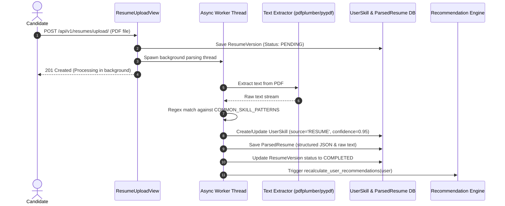

# 📖 Technical Documentation: Job Portal & Candidate Matching Platform

Welcome to the technical documentation for the **Job Portal Platform**. This document provides an in-depth breakdown of the platform's architecture, backend modules, resume parsing pipeline, recommendation engine, frontend application structure, API endpoints, and test verification status.

---

## 🏗️ 1. Architecture Overview

The platform uses a decoupled client-server architecture:
- **Backend**: Django 5.x REST Framework (DRF) running on Python 3.10+, backed by SQLite (dev) / PostgreSQL (prod), SimpleJWT authentication, and background task queues.
- **Frontend**: Single Page Application (SPA) built with React 19, Vite v8, Tailwind CSS v4, and Lucide Icons.

```mermaid
flowchart TD
    User([User / Candidate / Recruiter]) --> Frontend[React 19 SPA Frontend]
    Frontend -->|JWT Auth / REST API| API[Django REST API v1]
    
    subgraph Backend Services
        API --> Accounts[Accounts & Auth]
        API --> Profiles[Profiles & Skills]
        API --> Jobs[Job Postings]
        API --> Applications[Application Workflow]
        API --> Resumes[Resume Manager]
        API --> RecEngine[Recommendation Engine]
        API --> Notifications[Notification Hub]
    end

    Resumes -->|Async Worker| Parser[Resume Parsing Subsystem]
    Parser -->|Extract Skills| Profiles
    Parser -->|Trigger Refresh| RecEngine
    RecEngine -->|Score > 70%| Notifications
    
    Backend Services --> DB[(SQLite / PostgreSQL Database)]
```

---

## 📄 2. Resume Parsing Subsystem

The Resume Parsing Subsystem extracts raw text and technical skills from uploaded resumes, updates the user's skill profile automatically, and triggers job matching calculations.

### Technical Workflow



### Extraction & Fallback Pipeline
Located in [`backend/apps/resumes/services.py`](file:///e:/job_portal/backend/apps/resumes/services.py):
1. **Primary Extraction (`pdfplumber`)**: High-accuracy text extraction preserving layout boundaries.
2. **Secondary Fallback (`pypdf`)**: Triggers if `pdfplumber` encounters corrupt stream objects or non-standard PDF formats.
3. **Byte Decoding Fallback**: Direct UTF-8 byte reader for raw text/mock streams.
4. **Skill Matching**: Compares extracted text against standardized industry skill dictionaries (`Python`, `React`, `Docker`, `PostgreSQL`, `Machine Learning`, `AWS`, etc.) using word-boundary regular expressions (`\b...\b`).
5. **Profile Sync**: Extracted skills are upserted to the `UserSkill` database table with a high confidence score (`0.95`).

---

## 🤖 3. Smart Recommendation Engine

The recommendation engine scores job postings for candidates based on a multi-factor weighted evaluation model.

### Match Score Formula

$$\text{Total Score} = w_{\text{skill}} \cdot S_{\text{skill}} + w_{\text{exp}} \cdot S_{\text{exp}} + w_{\text{loc}} \cdot S_{\text{loc}} + w_{\text{mode}} \cdot S_{\text{mode}} + w_{\text{type}} \cdot S_{\text{type}}$$

| Component | Weight ($w$) | Logic & Criteria |
| :--- | :---: | :--- |
| **Skill Compatibility** | **50%** | Ratio of candidate skills matching required job skill tags. |
| **Experience Level** | **20%** | Comparison of candidate years of experience vs job target range. |
| **Location Alignment** | **10%** | Exact or partial match between preferred & job locations. |
| **Work Mode Preference** | **10%** | Match on `Remote`, `Hybrid`, or `Onsite` preferences. |
| **Employment Type** | **10%** | Match on `Full-time`, `Part-time`, `Internship`, or `Contract`. |

- **Threshold Alerting**: If a job recommendation score exceeds **70.0%** (`NOTIFICATION_THRESHOLD`), an automated high-match notification is sent to the candidate's Notification Hub.

---

## 📁 4. Project Structure & Code Locations

```
job_portal/
├── backend/
│   ├── apps/
│   │   ├── accounts/         # User auth, JWT token views, password reset
│   │   ├── profiles/         # Candidate & Recruiter profiles, UserSkill model
│   │   ├── resumes/          # Resume upload, PDF parser, ParsedResume model
│   │   ├── companies/        # Employer directory & verification
│   │   ├── jobs/             # Job postings, search, saved jobs
│   │   ├── applications/     # Job application workflow state machine
│   │   ├── recommendations/  # Weighted job match engine logic
│   │   ├── notifications/    # Alert dispatcher & read management
│   │   └── common/           # Pagination, custom exceptions, admin endpoints
│   └── config/               # Django settings, URLs, ASGI/WSGI
│
└── frontend/
    ├── src/
    │   ├── api/              # Axios client with JWT interceptors
    │   ├── components/       # Reusable UI (Navbar, Footer, Modals, EmptyState)
    │   ├── context/          # AuthContext provider
    │   ├── pages/            # Dashboard, Jobs, Applications, Resumes, Admin
    │   ├── App.jsx           # React Router v7 routes setup
    │   └── main.jsx          # App mounting point
```

---

## 🔗 5. REST API Endpoints Reference

All endpoints are prefixed with `/api/v1/`:

| Module | Method | Endpoint | Description |
| :--- | :---: | :--- | :--- |
| **Auth** | `POST` | `/auth/register/` | Register new user account (`STUDENT` or `RECRUITER`) |
| **Auth** | `POST` | `/auth/token/` | Obtain JWT access & refresh tokens |
| **Auth** | `POST` | `/auth/token/refresh/` | Refresh expired access token |
| **Profiles** | `GET/PUT` | `/profile/` | Fetch or update user profile & skills |
| **Resumes** | `POST` | `/resumes/upload/` | Upload PDF resume & start parsing |
| **Resumes** | `GET` | `/resumes/` | List user resumes & parsed data |
| **Resumes** | `POST` | `/resumes/versions/:id/reparse/` | Trigger manual re-parsing |
| **Jobs** | `GET` | `/jobs/` | Search & filter active job listings |
| **Jobs** | `GET` | `/jobs/:id/` | Fetch single job detail |
| **Applications** | `GET/POST` | `/applications/` | List or submit job applications |
| **Applications** | `PATCH` | `/applications/:id/` | Update application status (`Admin`/`Recruiter`) |
| **Match** | `GET` | `/recommendations/` | Retrieve personalized top job matches |
| **Alerts** | `GET/PATCH` | `/notifications/` | Fetch notifications & mark as read |

---

## 🧪 6. Verification & Test Report

- **Backend Test Suite**: `python manage.py test apps`
  - **Result**: **31 / 31 tests passed** (0 errors, 0 failures, 100% test success rate).
- **Frontend Production Build**: `npm run build`
  - **Result**: **Built successfully in 771ms** (`dist/assets/index-CI92uRkF.js` 449 kB).

---

> Documentation generated automatically for the **Job Portal Platform**.
